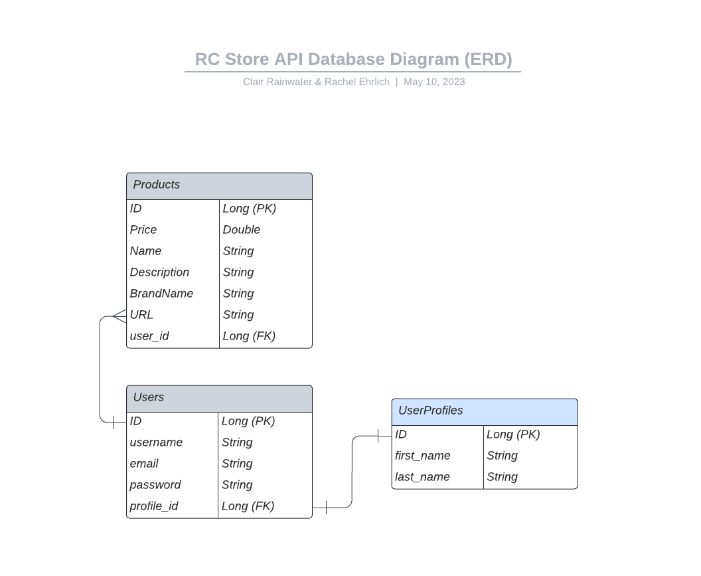
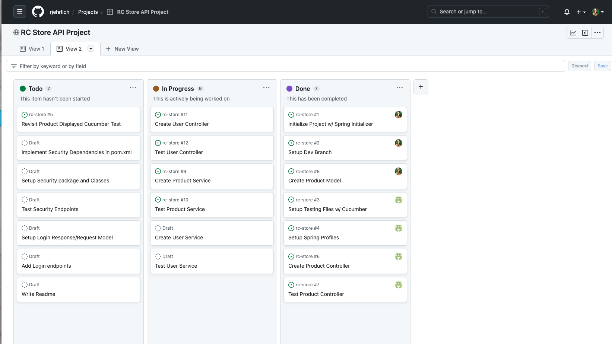

# RC Store API

* <a href="project-description"> Project Description</a>
* <a href="tools-technologies"> Tools & Technologies</a>
* <a href="general-approach"> General Project Approach</a>
* <a href="unsolved-problems"> Unsolved Problems / Hurdles</a>
* <a href="installation"> Installation Instructions/ Dependencies</a>
* <a href="credits"> Credits</a>

## Project Description
RC Store API is a clothing wishlist app where you can store multiple products from your favorite brands to purchase later.
* RC Store can be used to store all the clothes that match your personal style!
* You can even use it as a birthday or baby clothes wish list!

## Tools & Technologies
- 
- 
- 
- 
- 
- 

## General Project Approach
As a group we came together and decided our overall project process would consist of four important pieces. Planning our project in these 4 steps helped us keep on track of our to-do's and requirements. 

We planned out the following in each of the four areas:

### User Stories
* As a User, I want to create a profile so that I can save my personal information and preferences
* As a User, I want to be able to view and edit my profile information, including my name, email address, and password.
* As a User, I want to be able to view and save products in my profile.
* As a User, I want to be able to delete out of season products.
#### Nice to have in the future:
* As a user, I want to be able to add products to my cart and checkout securely.
* As a user, I want to receive email notifications about my order status and shipping updates.

### ERD Diagram


### Endpoint Mappings

#### Product Controller
| HTTP Methods 	| Full URL                             	|           URL          	|     Functionally     	|
|--------------	|--------------------------------------	|:----------------------:	|:--------------------:	|
| GET          	| http://localhost:8080/api/products/  	| /products/             	| List of all products 	|
| GET          	| http://localhost:8080/api/products/1 	| /products/{productId}/ 	| One product by ID    	|
| POST         	| http://localhost:8080/api/products/  	| /products/             	| Create new product   	|
| PUT          	| http://localhost:8080/api/products/  	| /products/{productId}/ 	| Save products        	|
| DELETE       	| http://localhost:8080/api/products/  	| /products/{productId}/ 	| Remove products      	|

#### User Controller

| HTTP Methods 	| Full URL                                  	|          URL         	|        Functionally       	|
|--------------	|-------------------------------------------	|:--------------------:	|:-------------------------:	|
| POST         	| http://localhost:8080/auth/users/login    	| /auth/users/login    	| Logs user in              	|
| POST         	| http://localhost:8080/auth/users/register 	| /auth/users/register 	| Registers/ creates a user 	|

--------
### Kanban Project Plan


[Project Plan Link](https://github.com/users/rjehrlich/projects/4)

## Unsolved Problems / Hurdles
One of our biggest hurdles was setting up JWT Token security w/ the Cucumber Test methods. We could not figure out how to authenticate a user to run the tests, but were able to knowledge transfer with our classmates. They helped us successfully debug and refactor our tests to fix the errors we were having.

We feel we've successfully completed the project to the requirements, so we don't have any unsolved problems. However, we did add some future considers for enhancements later on.

## Installation Instructions/ Dependencies

In order to use this codebase you will need to make sure you have the following dependencies in your pom.xml file:

```
<dependencies>
    <dependency>
        <groupId>org.springframework.boot</groupId>
        <artifactId>spring-boot-starter</artifactId>
    </dependency>

    <dependency>
        <groupId>org.springframework.boot</groupId>
        <artifactId>spring-boot-starter-test</artifactId>
        <scope>test</scope>
    </dependency>
    <dependency>
        <groupId>org.springframework.boot</groupId>
        <artifactId>spring-boot-starter-data-rest</artifactId>
    </dependency>
    <dependency>
        <groupId>org.springframework.boot</groupId>
        <artifactId>spring-boot-devtools</artifactId>
        <scope>runtime</scope>
        <optional>true</optional>
    </dependency>
    <dependency>
        <groupId>com.h2database</groupId>
        <artifactId>h2</artifactId>
        <scope>runtime</scope>
    </dependency>
    <dependency>
        <groupId>org.springframework.boot</groupId>
        <artifactId>spring-boot-starter-jdbc</artifactId>
    </dependency>
    <dependency>
        <groupId>org.springframework.boot</groupId>
        <artifactId>spring-boot-starter-data-jpa</artifactId>
    </dependency>
    <dependency>
        <groupId>junit</groupId>
        <artifactId>junit</artifactId>
        <scope>test</scope>
    </dependency>
    <dependency>
        <groupId>io.cucumber</groupId>
        <artifactId>cucumber-java</artifactId>
        <version>${cucumber.version}</version>
        <scope>test</scope>
    </dependency>
    <dependency>
        <groupId>io.cucumber</groupId>
        <artifactId>cucumber-junit</artifactId>
        <version>${cucumber.version}</version>
        <scope>test</scope>
    </dependency>
    <dependency>
        <groupId>io.cucumber</groupId>
        <artifactId>cucumber-spring</artifactId>
        <version>${cucumber.version}</version>
        <scope>test</scope>
    </dependency>
    <dependency>
        <groupId>io.rest-assured</groupId>
        <artifactId>rest-assured</artifactId>
        <version>4.3.0</version>
        <scope>test</scope>
    </dependency>
    <dependency>
        <groupId>org.springframework.boot</groupId>
        <artifactId>spring-boot-starter-web</artifactId>
        <version>3.0.5</version>
    </dependency>
    <dependency>
        <groupId>org.springframework.boot</groupId>
        <artifactId>spring-boot-starter-security</artifactId>
    </dependency>
    <!-- https://mvnrepository.com/artifact/io.jsonwebtoken/jjwt-api -->
    <dependency>
        <groupId>io.jsonwebtoken</groupId>
        <artifactId>jjwt-api</artifactId>
        <version>0.11.5</version>
    </dependency>
    <!-- https://mvnrepository.com/artifact/io.jsonwebtoken/jjwt-impl -->
    <dependency>
        <groupId>io.jsonwebtoken</groupId>
        <artifactId>jjwt-impl</artifactId>
        <version>0.11.5</version>
        <scope>runtime</scope>
    </dependency>
    <!-- https://mvnrepository.com/artifact/io.jsonwebtoken/jjwt-jackson -->
    <dependency>
        <groupId>io.jsonwebtoken</groupId>
        <artifactId>jjwt-jackson</artifactId>
        <version>0.11.5</version>
        <scope>runtime</scope>
    </dependency>
</dependencies>
```
In order to successfully replicate/ run Cucumber Tests you will need to add this property to your pom.xml property tag:

``<cucumber.version>6.8.1</cucumber.version>``

## Credits